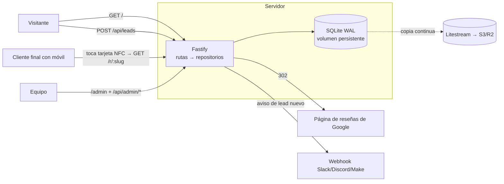
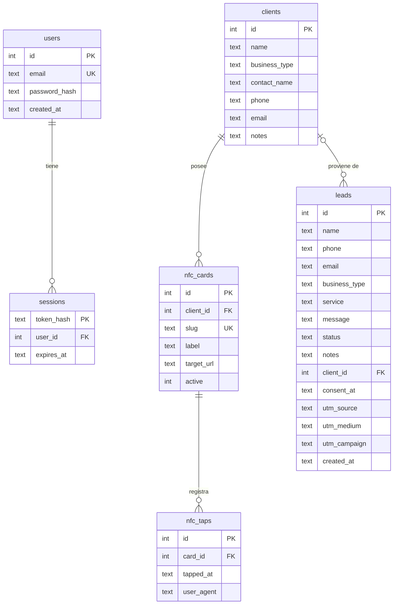

# Arquitectura: Alcance Isleño MVP

## 1. Qué problema resuelve el MVP (y qué no)

La landing original era 100 % estática: el formulario solo abría WhatsApp. Eso tiene tres fallos para un negocio que vive de captar clientes:

1. **Se pierden leads.** Si la persona cierra WhatsApp sin enviar el mensaje, no queda rastro. Tampoco se pide teléfono ni email.
2. **No hay datos.** No se sabe cuántas solicitudes llegan, de qué canal (Instagram, flyers, boca a boca) ni cuántas se convierten.
3. **El servicio estrella (tarjeta NFC) no tiene producto detrás.** Si la tarjeta lleva grabada la URL de Google directamente, no se puede medir su uso ni cambiar el destino sin reprogramarla, y no hay nada que justifique una cuota recurrente.

El MVP resuelve exactamente eso y nada más:

| Módulo | Qué hace |
|---|---|
| Web pública | La landing original, renderizada en servidor desde `src/content/site.js`, con SEO básico, páginas legales, `robots.txt` y `sitemap.xml`. |
| Captación de leads | El formulario guarda el lead en la base de datos (con consentimiento RGPD, UTM y antispam) y **después** ofrece seguir por WhatsApp. Aviso opcional a Slack/Discord. |
| Panel interno (`/admin`) | CRM mínimo: leads con estados y notas, conversión a cliente, clientes y tarjetas NFC. |
| Redirector NFC (`/r/:slug`) | Cada tarjeta apunta a un enlace propio que registra el uso y redirige a la página de reseñas. Destino editable, estadísticas por día, activar/desactivar. |

Queda **fuera** a propósito: pagos online, portal para clientes, multiidioma, blog, CMS visual. Ver la sección 8.

### Fase 0: web estática (lo que se publica ahora)

`npm run build` genera `dist/` con las mismas plantillas y contenido que usa el servidor, pero en modo `static`:
enlaces relativos (funciona en subcarpetas como GitHub Pages), formulario que abre WhatsApp sin guardar datos,
textos legales adaptados (sin tratamiento de datos en la web ni cookies) y sin el panel. Cero coste y cero mantenimiento.
Cuando se quiera guardar leads o vender las tarjetas NFC con estadísticas, se despliega el servidor sin reescribir la web.

## 2. Arquitectura del sistema

Monolito modular en Node.js. Un solo proceso sirve la web, la API y el panel. Es la opción más barata de operar para un equipo de tres personas y se puede dividir más adelante sin reescribir, porque las capas ya están separadas.



**Stack**

| Pieza | Elección | Por qué |
|---|---|---|
| Runtime | Node.js 22 LTS | Un solo lenguaje en front y back; sin paso de compilación. |
| Framework HTTP | Fastify 5 | Validación por JSON Schema integrada, rápido, plugins oficiales para seguridad. |
| Base de datos | SQLite (better-sqlite3) en modo WAL | Cero coste y cero mantenimiento. Aguanta sobradamente miles de leads y cientos de miles de usos NFC en un solo servidor. |
| Front público | HTML renderizado en servidor + CSS + 1 JS pequeño | Carga instantánea en móvil y buen SEO; sin framework. |
| Panel | SPA en JS nativo servida como estático | Sin build, sin dependencias de front. |
| Seguridad | `@fastify/helmet` (CSP estricta, HSTS), `@fastify/rate-limit`, cookies `httpOnly` + `SameSite=Strict`, scrypt | Ver sección 6. |

**Por qué es escalable aunque sea mínimo**

- Todo el SQL está en `src/repositories/`. Pasar a PostgreSQL es reescribir ese módulo, no la aplicación.
- La app es **sin estado** salvo la base de datos (las sesiones están en la BD), así que puede crecer a varias instancias en cuanto la BD sea un servicio externo.
- Las migraciones son ficheros SQL numerados y se aplican solas al arrancar.
- El contenido de la web está separado del código de presentación (`src/content/site.js`).

## 3. Estructura de archivos

```
alcance-isleno/
├── src/
│   ├── server.js              # Arranque, escucha y cierre ordenado (SIGTERM)
│   ├── app.js                 # buildApp(): plugins, seguridad, rutas, errores (testeable)
│   ├── config.js              # Variables de entorno validadas
│   ├── content/site.js        # ✏️ Textos, servicios, precios, equipo, datos legales
│   ├── db/
│   │   ├── index.js           # Conexión SQLite + runner de migraciones
│   │   └── migrations/001_init.sql
│   ├── repositories/index.js  # Acceso a datos (único sitio con SQL)
│   ├── lib/
│   │   ├── auth.js            # scrypt, tokens de sesión
│   │   └── notify.js          # Webhook de avisos
│   ├── routes/
│   │   ├── public.js          # /, páginas legales, robots, sitemap, healthz
│   │   ├── leads.js           # POST /api/leads
│   │   ├── redirect.js        # GET /r/:slug
│   │   ├── auth.js            # login / logout / me
│   │   └── admin.js           # /api/admin/*
│   └── views/                 # Plantillas HTML (funciones que devuelven strings escapados)
│       ├── html.js            # layout, escape, página de mensaje
│       ├── landing.js
│       └── legal.js
├── public/                    # Servido en /assets/*
│   ├── css/site.css
│   ├── js/site.js             # Envío del formulario
│   ├── img/favicon.svg
│   └── admin/                 # Panel: index.html, admin.css, admin.js
├── scripts/create-admin.js    # Alta de usuarios del panel
├── test/app.test.js           # Tests de integración (node:test + inject)
├── data/                      # Base de datos (ignorada por git)
├── Dockerfile
└── .env.example
```

## 4. Esquema de base de datos



Decisiones:

- `leads.status` es un embudo cerrado: `new → contacted → proposal → won | lost` (restricción `CHECK`).
- `leads.consent_at` guarda **cuándo** se aceptó la política de privacidad: es la prueba del consentimiento.
- `sessions` guarda solo el **hash** del token; robar la BD no permite suplantar sesiones.
- `nfc_taps` **no guarda IP**: minimización de datos. Suficiente para estadísticas.
- `nfc_cards.client_id` es `ON DELETE RESTRICT`: no se puede borrar un cliente con tarjetas en la calle.
- No hay endpoints de borrado: las tarjetas se desactivan y los leads se marcan como perdidos. Menos riesgo de errores irreversibles. (El borrado por derecho de supresión RGPD se hace hoy por SQL; ver roadmap.)

Índices: `leads(created_at)`, `leads(status, created_at)`, `nfc_taps(card_id, tapped_at)`, `nfc_cards(client_id)`, `sessions(expires_at)`.

## 5. API

Todas las respuestas son JSON. Errores: `{ "error": "mensaje", "details"?: [...] }`.

### Públicos

| Método | Ruta | Descripción | Límite |
|---|---|---|---|
| GET | `/` | Landing | — |
| GET | `/aviso-legal`, `/privacidad`, `/cookies` | Textos legales | — |
| GET | `/robots.txt`, `/sitemap.xml` | SEO | — |
| GET | `/healthz` | Comprueba app + BD | — |
| POST | `/api/leads` | Crea un lead | 5 / 10 min por IP |
| GET | `/r/:slug` | Registra uso y redirige (302). 404 si no existe, 410 si está desactivada | 30 / min por IP |

`POST /api/leads`

```json
{
  "name": "Marisol Pérez",          // 2-80, obligatorio
  "phone": "600 123 456",           // 6-30, [+0-9 ()-], obligatorio
  "email": "",                      // email válido o vacío
  "business_type": "Peluquería",    // ≤80
  "service": "nfc",                 // nfc | gbp | landing | varios | no-se
  "message": "…",                   // ≤1000
  "consent": true,                  // debe ser true
  "website": "",                    // honeypot: si trae algo, se responde 201 y se descarta
  "utm_source": "instagram"         // utm_source / utm_medium / utm_campaign opcionales
}
```
Respuestas: `201 {ok:true}`, `400` validación, `429` demasiadas peticiones.

### Autenticación

| Método | Ruta | Descripción |
|---|---|---|
| POST | `/api/auth/login` | `{email, password}` → cookie `ai_session`. 10 intentos / 15 min |
| POST | `/api/auth/logout` | Invalida la sesión |
| GET | `/api/auth/me` | Usuario actual o 401 |

### Panel (requieren sesión; 401 si no)

| Método | Ruta | Descripción |
|---|---|---|
| GET | `/api/admin/stats` | Leads por estado, leads y usos NFC de los últimos 30 días |
| GET | `/api/admin/leads?status=&q=&limit=&offset=` | Listado paginado con búsqueda → `{items, total}` |
| PATCH | `/api/admin/leads/:id` | `{status?, notes?}` |
| POST | `/api/admin/leads/:id/convert` | Crea cliente desde el lead y lo marca `won`. 409 si ya lo es |
| GET | `/api/admin/clients` | Clientes con nº de tarjetas |
| POST | `/api/admin/clients` | `{name, business_type?, contact_name?, phone?, email?, notes?}` |
| PATCH | `/api/admin/clients/:id` | Mismos campos, parciales |
| GET | `/api/admin/cards?client_id=` | Tarjetas con usos totales y de 30 días |
| POST | `/api/admin/cards` | `{client_id, target_url (https), label?, slug?}`. Slug aleatorio si no se indica; 409 si está en uso |
| PATCH | `/api/admin/cards/:id` | `{target_url?, label?, active?}` |
| GET | `/api/admin/cards/:id/taps?days=30` | Usos por día |

## 6. Seguridad y cumplimiento

- **CSP estricta** sin `unsafe-inline` y sin terceros: JS, CSS y tipografías (licencia OFL) se sirven desde la propia web.
- **CSRF**: cookie `SameSite=Strict` + la API solo acepta JSON (no hay parser de formularios).
- **Contraseñas**: scrypt con sal por usuario; comparación en tiempo constante, también cuando el email no existe.
- **Sesiones**: token aleatorio de 256 bits, solo el hash en BD, caducidad configurable, cookie `Secure` en producción.
- **Validación**: JSON Schema en todas las rutas; `additionalProperties: false` en las escrituras.
- **XSS**: las plantillas escapan todo; el panel usa `textContent`, nunca `innerHTML`.
- **Antispam**: honeypot + rate limit por IP (usar `TRUST_PROXY=true` detrás de un proxy).
- **Logs**: se ocultan cookies y cabeceras `set-cookie`.
- **RGPD / LSSI**: casilla de consentimiento obligatoria con fecha guardada, textos legales plantilla, sin cookies de analítica (no hace falta banner), sin IP en los usos NFC.

## 7. Arquitectura de interfaz

**Web pública.** HTML generado en el servidor una vez al arrancar (el contenido solo cambia con un despliegue), cacheado 5 min. Mantiene el diseño original: variables CSS en `:root`, mobile first con breakpoints a 760/820/860 px. El único JS gestiona el formulario:

```
validar en cliente → POST /api/leads → estado "Recibido" + botón "Continuar en WhatsApp"
                                     ↘ error / 429 / sin red → mensaje + WhatsApp como alternativa
```

El botón de WhatsApp se muestra tras guardar en lugar de abrirse solo, porque los navegadores bloquean `window.open` después de una petición asíncrona.

**Panel.** SPA de un solo fichero con tres pestañas (Leads, Clientes, Tarjetas NFC) y una franja de métricas. Patrón: `api()` centraliza `fetch` y redirige al login ante un 401; cada vista tiene un `loadX()` que pide datos y re-renderiza su lista con un helper `h()` que crea nodos DOM de forma segura.

## 8. Despliegue

Recomendado para empezar (≈ 5 €/mes): un servidor pequeño (Hetzner, Fly.io, Railway, Render con disco) con Docker y un volumen para `/app/data`.

```bash
docker build -t alcance-isleno .
docker run -d --name alcance -p 3000:3000 -v alcance-data:/app/data \
  -e PUBLIC_BASE_URL=https://alcanceisleno.es -e WHATSAPP_NUMBER=34600000000 \
  -e CONTACT_EMAIL=hola@alcanceisleno.es -e TRUST_PROXY=true alcance-isleno
docker exec -it alcance node scripts/create-admin.js equipo@alcanceisleno.es
```

Delante, un proxy con HTTPS automático (Caddy: `alcanceisleno.es { reverse_proxy localhost:3000 }`).
**Copias de seguridad**: Litestream replicando el fichero SQLite a un bucket S3/R2. Sin esto, perder el disco es perder todos los leads.

## 9. Cuándo y cómo escalar

| Señal | Acción |
|---|---|
| Hace falta más de una instancia o alta disponibilidad | Migrar `repositories/` a PostgreSQL gestionado (Neon, Supabase) |
| Los clientes quieren ver sus estadísticas NFC | Rol `client` en `users` + vista de solo lectura por `client_id` |
| El equipo edita textos a menudo | Mover `site.js` a una tabla `settings` editable desde el panel |
| Muchos usos NFC (>1 M filas) | Agregado diario `nfc_taps_daily` y purga de filas antiguas |
| Solicitudes de supresión RGPD | Endpoint `DELETE /api/admin/leads/:id` con registro de auditoría |
