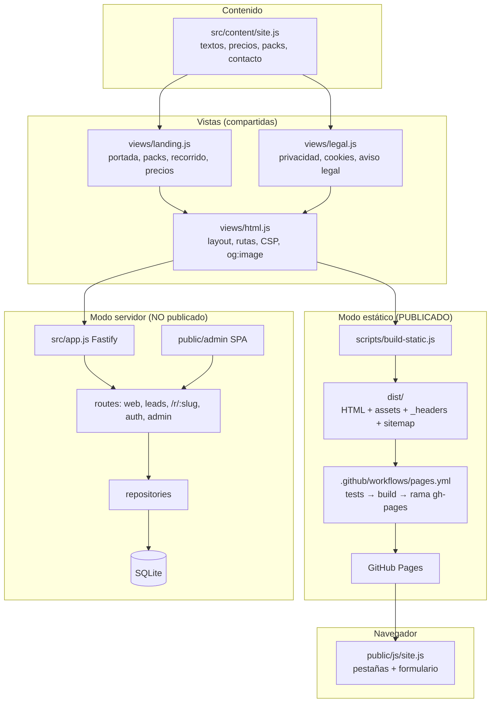

# Auditoría técnica y desglose para publicar

Revisión completa del repositorio como si fuera código heredado: ingeniería inversa de la arquitectura, flujo de datos, problemas encontrados (con lo que ya se ha corregido) y el desglose de la web lista para publicar.

Estado: rama `seccion-belleza`, **sin publicar**. 31 tests en verde.

---

## 1. Resumen ejecutivo

- **La web publicada es sana:** estática, 53 KB en total, sin dependencias de terceros en el navegador, accesible y rápida. No hay cuellos de botella de rendimiento.
- **El problema principal es de arquitectura, no de código:** el repositorio contiene **dos productos** (la web estática que se publica y una aplicación con servidor, base de datos y panel que no se usa). El 46 % del código y 6 de 7 dependencias sirven solo a la parte que no se publica, y aun así el despliegue las instala y las prueba.
- **El segundo problema era de datos:** el mismo producto estaba definido en varios sitios con nombres distintos (placa / tarjeta NFC / tarjeta de reseñas) y había importes escritos a mano en textos. Corregido; ahora hay tests que impiden que vuelva a pasar.
- **Faltaban piezas para publicar con garantías:** seguridad en GitHub Pages, vista previa al compartir por WhatsApp, menú en móvil y caché tras publicar. Corregido.

---

## 2. Arquitectura (ingeniería inversa)

### Flujo de datos de la web publicada

1. **Contenido:** todo lo editable vive en un único objeto JS, `src/content/site.js`: servicios, material, packs por tipo de negocio, textos, contacto y datos legales.
2. **Render:** `renderLanding()` recibe `site` + `config` (`static: true`) y compone el HTML con plantillas de texto y escape manual (`esc()`). Ahí mismo se derivan datos: precio del hosting, texto del pack, lista de precios y QR (generado con `qrcode` al construir).
3. **Build:** `build-static.js` escribe 4 páginas, copia `public/{css,js,img,fonts}` a `dist/assets`, calcula un hash de CSS y JS para la caché y genera `robots.txt`, `sitemap.xml`, `_headers` y `.nojekyll`.
4. **Despliegue:** en cada push a `main`, GitHub Actions ejecuta `npm ci`, los tests y el build, y fuerza un push de `dist/` a `gh-pages`.
5. **Navegador:** `site.js` activa las pestañas (carta y packs), gestiona los enlaces `#hosteleria` / `#cita-previa` y el formulario, que **no envía datos**: compone el mensaje y abre WhatsApp.

### Modo servidor (existe, no se publica)

Fastify + SQLite + panel `/admin`: guarda leads, gestiona clientes y sirve un redirector `/r/:slug` para tarjetas NFC con estadísticas. Comparte vistas con la web estática mediante ramas `config.static` en 3 archivos.

---

## 3. Hallazgos

Prioridad: **P0** bloquea publicar · **P1** afecta a clientes o a la operación · **P2** deuda técnica.

### 3.1 Decisiones de arquitectura

| # | Hallazgo | Impacto | Prioridad | Estado |
|---|---|---|---|---|
| A1 | **Dos productos en un repositorio.** 1.557 líneas y 6 dependencias (Fastify, SQLite nativo…) solo para el modo servidor, que no se usa. | El despliegue de una web estática instala y compila `better-sqlite3` y ejecuta tests del servidor: más lento y puede fallar por algo que no se publica. Cada cambio de contenido debe mantener compatible un modo que nadie usa. | P1 | Recomendado (§5) |
| A2 | **Vistas con ramas `config.static`** (enlaces, formulario, textos legales). | Dos comportamientos por archivo; fácil romper uno sin darse cuenta. | P2 | Recomendado |
| A3 | **Plantilla monolítica** (`landing.js`, 380 líneas) que mezcla derivar datos y generar HTML. | Difícil de leer y de cambiar sin efectos colaterales. | P2 | Recomendado |
| A4 | **Precios como texto** ("desde 200 €", "90 € / año"). | No se pueden calcular totales; el "antes 415 €" del pack era una suma hecha a mano. | P1 | Mitigado: test que verifica las sumas |

### 3.2 Lógica y datos duplicados

| # | Hallazgo | Estado |
|---|---|---|
| D1 | El producto de reseñas aparecía como "Placa de reseñas QR + NFC", "Tarjeta NFC de reseñas" y "tarjeta de reseñas", en 5 sitios. | **Corregido:** "Tarjeta de reseñas QR + NFC" en toda la web, con un test |
| D2 | "90 € al año" escrito a mano en el texto del recorrido. | **Corregido:** sale de la tarifa de hosting |
| D3 | El texto del pack completo repetía lo que incluye la pestaña de hostelería. | **Corregido:** se genera a partir de la pestaña |
| D4 | El recorrido sobrescribía nombre y texto de la landing. | **Corregido:** una sola definición en el catálogo |
| D5 | Campos que no se mostraban en ningún sitio (`benefit`, textos de servicios). Editarlos no cambiaba nada. | **Corregido:** eliminados |
| D6 | El panel de administración tiene su propia lista de nombres de servicios. | Corregido el nombre; la lista duplicada sigue (A1) |
| D7 | El móvil de la portada y los de las pestañas repiten el mismo marcado. | Recomendado: extraer un componente |

### 3.3 Rendimiento y cuellos de botella

| Medida | Valor |
|---|---|
| Transferencia total de la portada | **≈ 53 KB** (HTML 7,7 KB · CSS 5,8 KB · JS 2,4 KB · fuente 18,5 KB · textura 3 KB · foto 15 KB, con gzip) |
| Peticiones | 6 |
| Fuentes | 1 archivo, alojado en la propia web |
| Build | < 1 s |

Sin cuellos de botella técnicos. **El cuello de botella es humano:**
- Cualquier cambio de texto o precio exige editar JS y publicar desde git.
- No hay vista previa de las ramas, así que revisar un cambio depende de capturas.
- La web no mide nada: no hay analítica, así que no sabréis qué pack interesa más.

### 3.4 Escalabilidad

- **Un tercer tipo de negocio** (p. ej. comercio local) obligaría a añadir más casos especiales al modelo de pestañas: `pack: 'main'`, `hostingNote`, `option.items` frente a `option.price`, o el filtro de packs en la lista de precios. **Recomendado:** un catálogo único de productos con precio numérico y packs definidos como lista de ids de productos, con el "antes" calculado.
- **El contenido en JS** no escala a editores no técnicos: una coma mal puesta rompe el build. Los tests lo detectan antes de publicar, pero no lo evitan.
- **El modo servidor** (si algún día se usa) va sobre SQLite en un solo nodo con límites de peticiones en memoria. Es suficiente para empezar; ver `ARCHITECTURE.md` §9.

### 3.5 Mantenimiento

| # | Hallazgo | Estado |
|---|---|---|
| M1 | Test de la web: **un único test con 60 comprobaciones de textos exactos**; cada cambio de redacción lo rompía. | **Corregido:** 19 tests por tema, con valores tomados de `site.js` y comprobaciones de coherencia nuevas |
| M2 | CSS crecido por acumulación: numeración de secciones desordenada, `!important`, clases con nombres heredados (`.local-lista` en los packs). | Limpiadas las reglas muertas; renombrar pendiente (P2) |
| M3 | Recursos publicados sin uso: imágenes de 800 px (73 KB) y fuente cursiva (18 KB). | **Corregido** + test que lo impide |
| M4 | `ARCHITECTURE.md` describe sobre todo el modo servidor. | Recomendado: actualizar cuando se decida A1 |

### 3.6 Seguridad, SEO y experiencia

| # | Hallazgo | Prioridad | Estado |
|---|---|---|---|
| S1 | **GitHub Pages ignora `_headers`:** la web publicada no tenía ninguna política de seguridad (CSP). | P0 | **Corregido:** CSP y referrer como `<meta>` |
| S2 | Tras publicar, GitHub guarda CSS y JS 10 minutos en caché: HTML nuevo con estilos viejos. | P1 | **Corregido:** `?v=<hash>` |
| S3 | Sin imagen al compartir el enlace por WhatsApp, vuestro canal principal. | P1 | **Corregido:** `og:image` 1200×630 |
| S4 | En móvil el menú desaparecía por completo. | P1 | **Corregido:** segunda fila desplazable |
| S5 | El menú no seguía el orden de la página. | P2 | **Corregido** + test |
| S6 | La página 404 se veía sin estilos en rutas con subcarpetas. | P2 | **Corregido:** `<base>` |
| S7 | Falta el aviso legal (LSSI) mientras no haya titular. | P1 (legal) | Decisión de negocio: rellenar `legal` en `site.js` |
| S8 | Sin datos estructurados `LocalBusiness` para Google. | P2 | Recomendado |
| S9 | La URL contiene `Alcance-isle-o-`. | P2 | Renombrar el repositorio o usar dominio propio |

---

## 4. Desglose de la web lista para publicar

**URL:** `https://arieldiaz662-svg.github.io/Alcance-isle-o-/` · **Páginas:** inicio, privacidad, cookies, 404.

### 4.1 Estructura de la portada (en orden)

| # | Sección | Contenido | Acción principal |
|---|---|---|---|
| 1 | **Portada** | "Tu escaparate digital" · "Presencia digital para negocios locales de Tenerife…" · mesa con carta digital funcionando (pestañas), expositor con **QR real**, barraquito | *Pide tu diagnóstico gratuito* → WhatsApp |
| 2 | **¿Qué tipo de negocio tienes?** (pestañas) | **Bares, restaurantes y cafeterías:** pack completo, material para mesas · **Negocios con cita previa:** pack, hosting aparte, tarjetas de visita | *Pide información para tu local / negocio* → WhatsApp con mensaje propio |
| 3 | **Así llega un cliente a tu negocio** | Te busca en Google → Mira tu carta o tus servicios → Te deja una reseña, con el servicio y precio de cada paso | — |
| 4 | **Por qué elegirnos** | 5 motivos: equipo local, puesta en marcha ágil, todo conectado, formación, diagnóstico gratuito | — |
| 5 | **Así trabajamos** | Diagnóstico → Lo preparamos → Entrega y formación · pago 50 % / 50 % | — |
| 6 | **Precios** | Carta de precios con puntos guía (tabla 4.2) | — |
| 7 | **¿Hablamos?** | Teléfono, WhatsApp y formulario (abre WhatsApp, no guarda datos) | *Enviar por WhatsApp* |

**Menú:** Packs · Servicios · Por qué elegirnos · Precios · Hablemos (también en móvil).

### 4.2 Precios publicados (sin IGIC)

| Concepto | Precio |
|---|---|
| **Pack completo para hostelería** (landing con carta + ficha de Google + hosting 1.er año + tarjeta de reseñas de regalo) | ~~415 €~~ **390 €** |
| **Pack negocios con cita previa** (web + tarjeta de reseñas; hosting aparte) | **225 €** |
| Landing page con carta digital o servicios | desde 200 € |
| Creación u optimización de la ficha de Google Business | 100 € |
| Hosting y dominio (12 meses) | 90 € / año |
| Cambio puntual de contenido | 15 € / cambio |
| Actualización completa de la carta | 40 € |
| Expositor de mesa personalizado (3D, Tenerife) | 10 € / unidad |
| Pegatinas QR para mesa | 50 € / 10 uds. |
| Tarjeta de reseñas QR + NFC | 25 € |
| Tarjetas de visita personalizadas (opcional, cita previa) | 50 € / 100 uds. |

### 4.3 Mensajes de WhatsApp que recibiréis (+34 623 24 32 94)

| Origen | Mensaje precargado |
|---|---|
| Botón de portada | "Hola, me gustaría pedir el diagnóstico gratuito para mi negocio" |
| QR del expositor | "Hola, quiero mi escaparate digital" |
| Pestaña hostelería | "Hola, tengo un bar, restaurante o cafetería y quiero información sobre el pack completo" |
| Pestaña cita previa | "Hola, tengo un negocio con cita previa y quiero información sobre el pack de web y tarjeta de reseñas" |
| Botón de contacto | "Hola, quiero información sobre Alcance Isleño" |
| Formulario | "Hola, soy {nombre} y tengo un negocio de tipo: {tipo}. {mensaje}" |

Cada mensaje dice de dónde viene el cliente: sirve como analítica básica mientras no haya otra.

### 4.4 Ficha técnica

| Aspecto | Estado |
|---|---|
| Peso | ≈ 53 KB, 6 peticiones |
| Seguridad | CSP estricta sin terceros, sin cookies, sin datos guardados |
| SEO | Título, descripción, canonical, sitemap, robots, `og:image` |
| Accesibilidad | Pestañas con teclado (flechas, Inicio/Fin), jerarquía de títulos correcta, contraste AA, sin JavaScript se ve todo el contenido |
| Responsive | Verificado a 360, 390, 820 y 1280 px sin desbordes |
| Enlaces profundos | `…/#hosteleria` y `…/#cita-previa` abren su pestaña |
| Tests | 31 (web estática + servidor) |

### 4.5 Lista de comprobación antes de publicar

- [x] Tests en verde (31/31)
- [x] Sin enlaces internos rotos (test)
- [x] Sumas de los packs coherentes (test)
- [x] Un solo nombre por producto (test)
- [x] Sin plazos de entrega publicados (test)
- [x] CSP activa sin romper pestañas, formulario ni QR (verificado en navegador)
- [x] QR decodificado desde captura → WhatsApp correcto
- [ ] **Revisar en el móvil de alguien del equipo** tras publicar (WhatsApp real, QR desde otra pantalla)
- [ ] Aviso legal (cuando haya titular)
- [ ] Foto real del expositor (sustituir `img/productos/expositor-mesa-480.*` y quitar `caption`)
- [ ] Regenerar la imagen de vista previa si cambia la portada: `npm run build && npm run og-image`

**Publicar:** fusionar `seccion-belleza` en `main`. El flujo de GitHub lo publica en 1–2 minutos.

---

## 5. Recomendaciones priorizadas (no aplicadas)

1. **Decidir el futuro del modo servidor (A1).** Opciones:
   - **Separarlo** en `server/` con su propio `package.json`: la web estática queda con una sola dependencia (`qrcode`).
   - **Archivarlo** en una rama y borrarlo de `main`.

   Mientras no se use, es coste de mantenimiento sin retorno.
2. **Catálogo de productos único con precios numéricos** (A4, 3.4), antes de añadir un tercer tipo de negocio.
3. **Analítica sin cookies** (p. ej. GoatCounter o Plausible) para saber qué pestaña y qué botón funcionan. Requiere actualizar la política de cookies.
4. **Vista previa por rama** (Netlify o Cloudflare Pages conectados al repositorio) para revisar cambios sin capturas.
5. **Datos estructurados `LocalBusiness`** y **dominio propio** cuando el negocio esté formalizado.
6. **Dividir `landing.js`** en componentes (portada, packs, precios) y **renombrar clases heredadas** del CSS.
